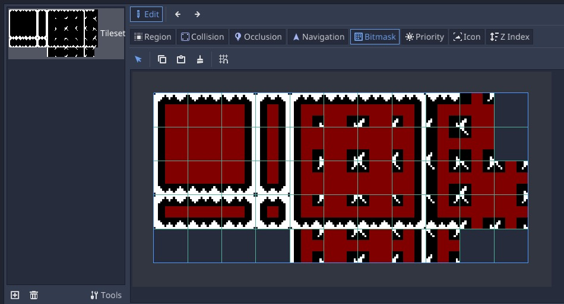
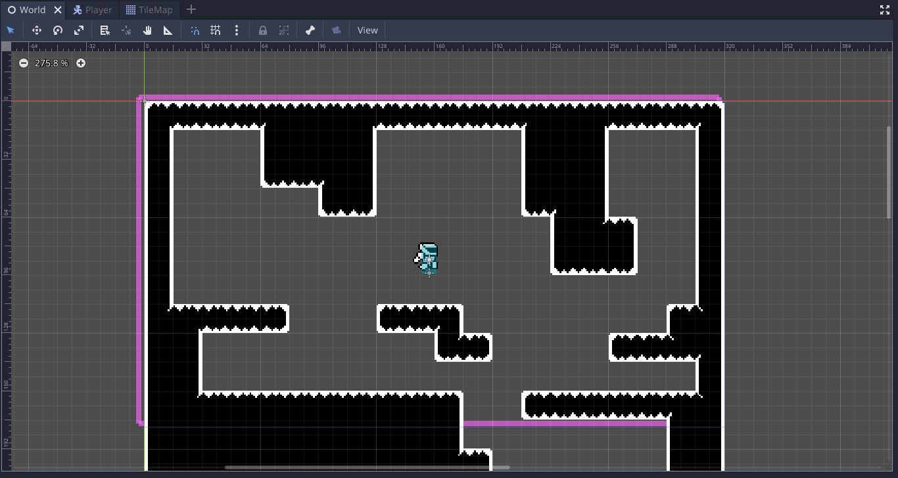
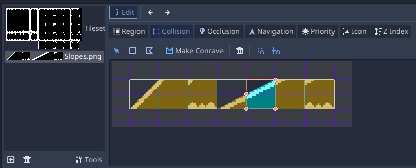
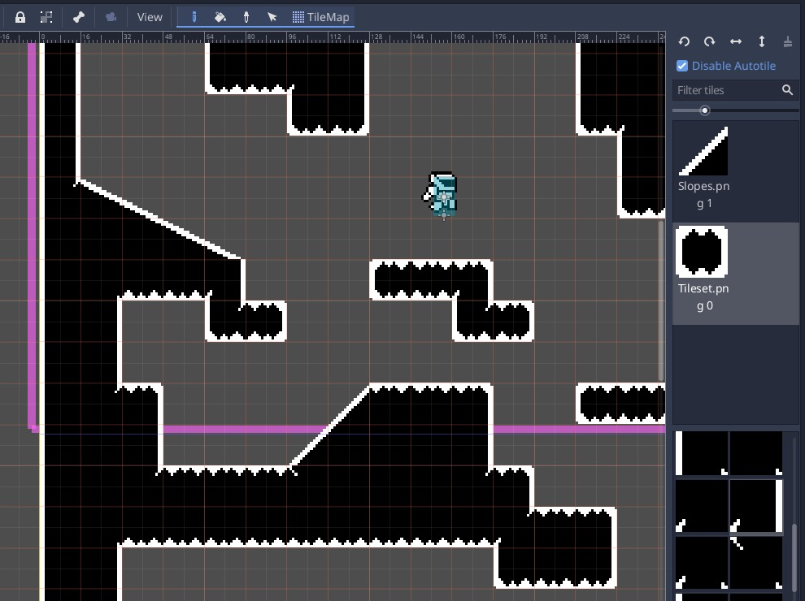

# Metroidvania Game
Godot 3.5.x

A basic game made in Godot, following the course: https://heartbeast-gamedev-school.teachable.com/p/1-bit-godot-course

## Table of Contents
- [Metroidvania Game](#metroidvania-game)
	- [Table of Contents](#table-of-contents)
	- [Screenshots](#screenshots)
	- [Player Movement](#player-movement)
		- [Slide with Snap](#slide-with-snap)
		- [Edge Jump](#edge-jump)
	- [Player Animations](#player-animations)
	- [Camera following Player](#camera-following-player)
	- [TileMap](#tilemap)
	- [Slope Tiles](#slope-tiles)
	- [Dust VFX](#dust-vfx)
	- [Player Gun](#player-gun)
	- [Player Bullets](#player-bullets)
	- [Fire Bullet Timer](#fire-bullet-timer)
	- [Moving Platforms](#moving-platforms)
		- [Nodes Hierarchy](#nodes-hierarchy)
		- [Behaviors](#behaviors)
	- [Walking Enemies](#walking-enemies)
	- [Hurt/Hit Boxes](#hurthit-boxes)
  
## Screenshots


## Player Movement

- Get the player input, in this case we only care about the X axis, the jump/gravity will take care of Y axis.
- Apply the horizontal acceleration based on input.
- Apply friction to damp the movement when no player input is happening.
- Check if jumping, and apply the jump force to the movement.
  - Detect mid jump release of jump input, to interrupt the jump and let players adjust jump height.
- Apply gravity.
-  Lastly, move the kinetic rigid body based on the movement calculation.
  - Use `move_and_slide` to allow sliding over other rigid bodies.

```py
func _physics_process(delta):
	var input_vector = get_input_vector()
	apply_horizontal_acceleration(input_vector, delta)
	apply_friction(input_vector)
	jump_check()
	apply_gravity(delta)
	move()
```

```py
func get_input_vector() -> Vector2:
	var vec = Vector2.ZERO
	vec.x = Input.get_action_strength("ui_right") - Input.get_action_strength("ui_left")
	# vec.y = Input.get_action_strength("ui_down") - Input.get_action_strength("ui_up")
	return vec
	
func apply_horizontal_acceleration(input_vector: Vector2, delta: float):
	if input_vector.x != 0:
		linear_velocity.x += input_vector.x * ACCELERATION * delta
		linear_velocity.x = clamp(linear_velocity.x, -MAX_HORIZONTAL_SPEED, MAX_HORIZONTAL_SPEED)
		
func apply_friction(input_vector: Vector2):
	if is_on_floor() and input_vector.x == 0:
		linear_velocity.x = lerp(linear_velocity.x, 0, FRICTION) 
		
func jump_check():
	just_jumped = false
	if is_on_floor() or edge_jump_timer.time_left > 0:
		if Input.is_action_just_pressed("ui_up"):
			linear_velocity.y = -JUMP_SPEED
			just_jumped = true
			emit_signal("jumped")
	else:
		interrupt_jump()
		
func interrupt_jump():
	var half_jump_speed = -JUMP_SPEED / 2
	if Input.is_action_just_released("ui_up") and linear_velocity.y < half_jump_speed:
		linear_velocity.y = half_jump_speed

func apply_gravity(delta: float):
	if not is_on_floor():
		linear_velocity.y += GRAVITY_ACCELERATION * delta
		linear_velocity.y = min(linear_velocity.y, JUMP_SPEED)
	
# if colliding with other rigid bodies, it will prevent movement
# returns the "leftover" linear_velocity, to be able to slide over other rigid bodies
func move():
	linear_velocity = move_and_slide(linear_velocity, ground_normal, stop_on_slopes)
```

### Slide with Snap

- Using the `move_with_slide_and_snap()` function, we ensure the player stays grounded when moving on slopes.

```py
# movement
var linear_velocity = Vector2.ZERO

# ground and snapping
export (int) var MAX_SLOPE_ANGLE = 46
var ground_normal = Vector2.UP
var stop_on_slope = true
var max_slides = 4
var snap_vector = Vector2.DOWN

func move():
	linear_velocity = move_and_slide_with_snap(
		linear_velocity, 
		snap_vector,
		ground_normal, 
		stop_on_slope,
		max_slides,
		deg2rad(MAX_SLOPE_ANGLE)
	)
```

### Edge Jump

- Allow a "grace period" for the player to jump off the edges.

```py
# jumping
var just_jumped : bool = false
onready var edge_jump_timer : Timer = $EdgeJumpTimer

func jump_check():
	just_jumped = false
	if is_on_floor() or edge_jump_timer.time_left > 0:
		if Input.is_action_just_pressed("ui_up"):
			...
			just_jumped = true
	...

func move():
	var was_on_floor = is_on_floor()
	linear_velocity = move_and_slide_with_snap(...)
	
	if was_on_floor and not is_on_floor() and not just_jumped:
		edge_jump_timer.start()
```

## Player Animations

- Create `Idle`, `Run` and `Jump` animations.
- Play the corresponding animation depending on the action.

```py
func update_animations(input_vector: Vector2):
	if input_vector.x != 0:
		sprite.scale.x = sign(input_vector.x)
		animator.play("Run")
	else:
		animator.play("Idle")
		
	if not is_on_floor():
		animator.play("Jump")
```

## Camera following Player

- Use a `RemoteTransform` in the `Player` scene.
- Setup a `Camera2D` in the main scene
  - Mark the Player scene as `Editable Children`
  - Assign the Camera to the node path in the `RemoteTransform` inside the `Player`
  - Mark the Camera to have smoothness in the movement.

## TileMap

- Enable `GPU pixel snapping` in the project settings, to fix some artifacts.
- Set the default clear color to black `VisualServer.set_default_clear_color(Color.black)`
- Create a new `Scene` with a root `TileMap` Node.
- Set `Cell` Size to 16x16.
- Add a `TileSet` resource to the `TileMap`.
  - Add Sprite with the `TileSet`.
  - Define the `Region` in the `TileSet`.
  - Set the `subtile_size` to 16x16.
  - Set the `autotile_bitmask_mode` to 3x3 (minimal).
  - Define the `Bitmask` to tell the Autotile how to piece together the tiles.
  - Define the `Collision` to tell the Autotile where to put colliders.





## Slope Tiles

- Create a new `Atlas` inside the `Tileset`
- Define just the collisions.
- In the `World` scene now you can place individual tiles from this.
  - To fix the awkward connections, disable `Autotile` and place individual tiles from the main `Autotile`
  - You can `Flip Horizontally` to achieve creative solutions, remember to always `Clear Transform` to not mess the autotile.




## Dust VFX (Scene Inheritance)

- VFX
  - Create a `Base Scene` for VFXs, with a `Sprite` node and an `AnimationPlayer` node.
  - Inherit from the base VFX scene, and create a `Dust` VFX.
  - Make an animation for the sprite, and add a script that moves the dust effect in a random direction.
- Player
  - Add a child node called `DustSpawner` to the Player scene.
  - Add signals for `jumped` and `landed` to the `Player` script.
  - In the run animation add a track to call `spawn_dust_effect` in the `DustSpawner`, everytime the player steps on the floor.
  - Connect the `jumped` and `landed` signals from the `Player` into the `DustSpawner`, and make them `spawn_dust_effect`.

## Player Gun

- Player Gun
  - New `PlayerGun` scene with a child `Sprite` and also a `Position2D` to mark the origin of the projectiles.
  - `PlayerGun` script that makes the gun face the mouse using `rotation = player.get_local_mouse_position().angle()`
- Player
  - Make the sprite face the mouse using the local mouse position sign.
  - Make the animation play in reverse if the movement sign and the gun pointing sign mismatch.

```py
var movement_sign = sign(input_vector.x)
var gun_pointing_sign = sign(get_local_mouse_position().x)

sprite.scale.x = gun_pointing_sign

if input_vector.x != 0:
	animator.play("Run")
	animator.playback_speed = movement_sign * gun_pointing_sign
else:
	animator.play("Idle")
	animator.playback_speed = 1
```

## Player Bullets

- Create a Base Scene called `Projectile` and an associated script with the same name.
- This scene will have a `Sprite`, a `VisibilityNotidier2D` and an `AnimationPlayer`.

```py
extends Node2D

class_name Projectile

var velocity : Vector2 = Vector2.ZERO

func _process(delta):
	position += velocity * delta

func _on_VisibilityNotifier2D_viewport_exited(viewport):
	queue_free()
```

- Create an Inherited Scene called `PlayerBullet` and also extend the `Projectile.gd` script into a `PlayerBullet.gd` script.
- The `PlayerBullet` will start without processing it's movement, until the animation of the fire explosion is done.

```py
extends Projectile

class_name PlayerBullet

func _ready():
	set_process(false) # don't move the bullet until the fire animation finishes
```

- In the `PlayerGun` script, fire a bullet whenever the `fire` input is pressed.
- Use the `PlayerGun` rotation to make the `PlayerBullets` go in the same direction.
- Use the `parent.scale.x` (the `Sprite` in the `Player`) to determine the direction of the velocity of the `PlayerBullet`.

```py
extends Node2D

export (float) var BULLET_SPEED = 250

onready var parent = get_parent()
onready var fire_origin = $Sprite/FireOrigin

var Utils = preload("res://Scripts/Utils.gd")
var PlayerBullet = preload("res://Scenes/Player/PlayerBullet.tscn")

func _process(_delta):
	point_to_mouse()
	fire_bullet()

func point_to_mouse():
	rotation = parent.get_local_mouse_position().angle()

func fire_bullet():
	if Input.is_action_just_pressed("fire"):
		var bullet : PlayerBullet = Utils.instantiate(self, PlayerBullet, fire_origin.global_position)
		bullet.velocity = Vector2.RIGHT.rotated(rotation) * BULLET_SPEED
		bullet.velocity.x *= parent.scale.x # the sprite is flipped
		bullet.rotation = bullet.velocity.angle()
```

## Fire Bullet Timer

- Add a `Timer` in the `PlayerGun`.
- Make it `one_shot` and start each time a bullet is fired.
- Don't let another bullet be fired until the timer reaches zero.
- This implements a fire rate, and lets us just leave the click button pressed and rapid fire.

## Moving Platforms

### Nodes Hierarchy

- Path2D
  - PathFollow2D
    - KinematicRigidBody2D
      - Sprite
      - CollissionShape2D
- AnimationPlayer

### Behaviors

- Make the `CollisisonShape2D` to have a `one_way_collission`.
- Make the `PathFollow2D` follow a path in the `Path2D`.
- Save the paths as resources to be able to reuse them.
- Use the `AnimationPlayer` to animate the `unit_offset` of the `PathFollow2D`.
- Make animation less glitchy
  - Make the `AnimationPlayer` to have `process_mode` = `physics`.

## Walking Enemies (Script Inheritance)

- Base `Enemy` Scene and Script.
- Has a `linear_velocity` vector and a `MAX_SPEED`.
- The `WalkingEnemy` Scene inherits from the `Enemy` Scene, and its script also extends `Enemy.gd`
- The `WalkingEnemy` will just apply the `MAX_SPEED` to move left or right.
- A set of `RayCast2D` Nodes will be constantly checking for `walls` or `edges` on the floor, and make the enemy turn around.
- Update the `Physics2D` Layers to define the `Player`, `Enemies` and `World` Layers.

## Hurt/Hit Boxes

- The `HitBox` will be associated with attacks and projectiles, defining the colliders for the parts that inflict damage.
- The `HurtBox` will be associated with parts of actos that should take damage when colliding with hitboxes.
- The `HurtBox` emits a signal when it collides when a hitbox, the hitbox tells the hurtbox to take damage on collision.

## Projectile Explosion

- VFX
  - Inherit from the base VFX scene, and create a `Explosion` VFX.
- Projectile
  - In `body_entered` and `area_entered`, instantiate an `Explosion` VFX before ivoking `queue_free()`

## Player Jump VFX

- VFX
  - Inherit from the base VFX scene, and create a `Jump` VFX.
- Player
  - Add a child node called `JumpVFXSpawner` to the Player scene.
  - Connect the `jumped` signal from the `Player` into the `JumpVFXSpawner`, and make them `spawn_effect()`.
  
## Enemy Stats

- Component to keep track of the current hp of the enemy.
- From the `Enemy` Node, everytime the `hurtbox` is hit, deduct the `damage` form the `hp` of the enemy.
- The `EnemyStats` will emit a `signal` called `enemy_died`, which will be connected to the `Enemy` Node, to `queue_free()`

## Player Stats Manager
- Add a `Hurtbox` to the `Player` and a `Hitbox` to the `WalkingEnemy`.
- Add a `PlayerStats` Node to the Player, which will be reacting to the `hit` signals coming from the `Hurtbox`.
- Add an `AnimationPlayer` to animate the invincibility blinking after getting hit.

## Custom Resources 

- Create a `preloaded` global singleton that preloads the custom `Resources`.
- For now just preload `PlayerStats`.

### Player Stats

- Script that inherits from `Resource`.
- It would be similar to a "Scriptable Object" in Unity.
- Create a `.tres` off of the script, and preload it in the `ResourcesLoader` singleton.
- The `PlayerStatsManager` node in the Player scene will be in charge of: 
  - Connecting to the `player_died` signal.
  - Substracting `hp` from the `PlayerStats` whenever the `Hurtbox` signals that it was `hit`.

## Events Bus

- Define an `EventsBus` global singleton to implement communication between nodes.

```py
extends Node

# by event id
var events_listeners : Dictionary = {}

func register_listener(event: String, listener: Object, callback_name: String) -> int:
	if not events_listeners.has(event):
		events_listeners[event] = []
	
	events_listeners[event].append({
		object = listener,
		callback_name = callback_name
	})
	
	return events_listeners[event].size() - 1

func unregister_listener(event: String, listener_idx: int):
	if not events_listeners.has(event) or events_listeners[event].size() == 0:
		push_warning("unregister_listener: there are no registered listeners for event %s" % event)
		return
		
	events_listeners[event].remove(listener_idx)

func trigger(event: String, args: Dictionary):
	if not events_listeners.has(event) or events_listeners[event].size() == 0:
		push_warning("trigger: there are no registered listeners for event %s" % event)
		return
	
	for listener in events_listeners[event]:
		# https://docs.huihoo.com/godotengine/godot-docs/godot/classes/class_object.html#class-object-callv
		listener.object.callv(listener.callback_name, args.values())
```

## Camera Shake

- Make the `Camera` register as listener to the event `player_hit`.
- Make the `PlayerStatsManager` trigger the event `player_hit`.

```py
extends Camera2D

...

onready var events_bus = EventsBus

func _ready():
	events_bus.register_listener("player_hit", self, "screen_shake") 
```

```py
extends Node

class_name PlayerStatsManager

onready var events_bus = EventsBus

...

func _on_HurtBox_hit(damage: int):
	...
	events_bus.trigger("player_hit", { offset = 2, duration = .5 })
```