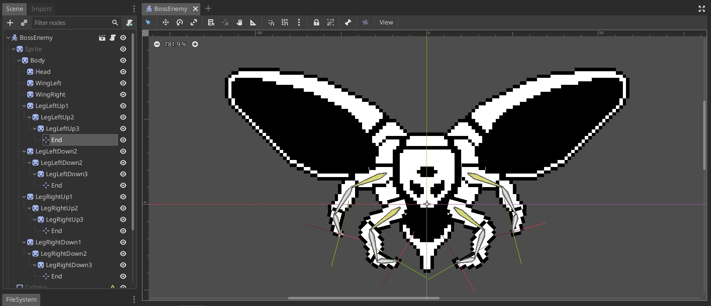

# Metroidvania Game
Godot 3.5.x

A basic game made in Godot, following the course: https://heartbeast-gamedev-school.teachable.com/p/1-bit-godot-course

## Table of Contents
- [Metroidvania Game](#metroidvania-game)
	- [Table of Contents](#table-of-contents)
	- [Screenshots](#screenshots)
	- [Player Movement](#player-movement)
		- [Slide with Snap](#slide-with-snap)
		- [Edge Jump](#edge-jump)
		- [Double Jump (Air Jump)](#double-jump-air-jump)
		- [Wall Slide](#wall-slide)
	- [Player Animations](#player-animations)
	- [Camera following Player](#camera-following-player)
	- [TileMap](#tilemap)
	- [Slope Tiles](#slope-tiles)
	- [Dust VFX (Scene Inheritance)](#dust-vfx-scene-inheritance)
		- [Wall Slide Dust VFX](#wall-slide-dust-vfx)
		- [Wall Dust VFX](#wall-dust-vfx)
	- [Player Gun](#player-gun)
	- [Player Bullets](#player-bullets)
	- [Fire Bullet Timer](#fire-bullet-timer)
	- [Moving Platforms](#moving-platforms)
		- [Nodes Hierarchy](#nodes-hierarchy)
		- [Behaviors](#behaviors)
	- [Walking Enemies (Script Inheritance)](#walking-enemies-script-inheritance)
	- [Hurt/Hit Boxes](#hurthit-boxes)
	- [Projectile Explosion](#projectile-explosion)
	- [Player Jump VFX](#player-jump-vfx)
	- [Enemy Stats](#enemy-stats)
	- [Player Stats Manager](#player-stats-manager)
	- [Custom Resources](#custom-resources)
		- [Player Stats](#player-stats)
	- [Events Bus](#events-bus)
	- [Camera Shake](#camera-shake)
	- [Player HP Bar](#player-hp-bar)
	- [Start Menu](#start-menu)
		- [Nodes Hierarchy](#nodes-hierarchy-1)
		- [UI Theme](#ui-theme)
		- [Fonts](#fonts)
		- [StyleBox](#stylebox)
	- [Pause Menu](#pause-menu)
	- [Flying Enemy](#flying-enemy)
	- [Enemy Death VFX](#enemy-death-vfx)
	- [Plant Enemy](#plant-enemy)
	- [Crawling Enemy](#crawling-enemy)
	- [Player Missile](#player-missile)
		- [Missile Scene](#missile-scene)
		- [Fire Missile](#fire-missile)
		- [Knockback](#knockback)
	- [Player Missiles UI](#player-missiles-ui)
	- [Missile Destroyable Exlusives](#missile-destroyable-exlusives)
	- [Powerup](#powerup)
		- [Missile Powerup](#missile-powerup)
	- [Levels](#levels)
	- [Doors](#doors)
	- [Changing Levels](#changing-levels)
	- [Boss Enemy Rigging](#boss-enemy-rigging)
	- [Boss Enemy Animation](#boss-enemy-animation)
	- [Boss Enemy Behaviors](#boss-enemy-behaviors)
	- [Triggers and Door Blocks](#triggers-and-door-blocks)
	- [Save and Load Game](#save-and-load-game)
	- [Save Stations](#save-stations)
  
## Screenshots


## Player Movement

- Get the player input, in this case we only care about the X axis, the jump/gravity will take care of Y axis.
- Apply the horizontal acceleration based on input.
- Apply friction to damp the movement when no player input is happening.
- Check if jumping, and apply the jump force to the movement.
  - Detect mid jump release of jump input, to interrupt the jump and let players adjust jump height.
- Apply gravity.
-  Lastly, move the kinetic rigid body based on the movement calculation.
  - Use `move_and_slide` to allow sliding over other rigid bodies.

```py
func _physics_process(delta):
	var input_vector = get_input_vector()
	apply_horizontal_acceleration(input_vector, delta)
	apply_friction(input_vector)
	jump_check()
	apply_gravity(delta)
	move()
```

```py
func get_input_vector() -> Vector2:
	var vec = Vector2.ZERO
	vec.x = Input.get_action_strength("ui_right") - Input.get_action_strength("ui_left")
	# vec.y = Input.get_action_strength("ui_down") - Input.get_action_strength("ui_up")
	return vec
	
func apply_horizontal_acceleration(input_vector: Vector2, delta: float):
	if input_vector.x != 0:
		linear_velocity.x += input_vector.x * ACCELERATION * delta
		linear_velocity.x = clamp(linear_velocity.x, -MAX_HORIZONTAL_SPEED, MAX_HORIZONTAL_SPEED)
		
func apply_friction(input_vector: Vector2):
	if is_on_floor() and input_vector.x == 0:
		linear_velocity.x = lerp(linear_velocity.x, 0, FRICTION) 
		
func jump_check():
	just_jumped = false
	if is_on_floor() or edge_jump_timer.time_left > 0:
		if Input.is_action_just_pressed("ui_up"):
			linear_velocity.y = -JUMP_SPEED
			just_jumped = true
			emit_signal("jumped")
	else:
		interrupt_jump()
		
func interrupt_jump():
	var half_jump_speed = -JUMP_SPEED / 2
	if Input.is_action_just_released("ui_up") and linear_velocity.y < half_jump_speed:
		linear_velocity.y = half_jump_speed

func apply_gravity(delta: float):
	if not is_on_floor():
		linear_velocity.y += GRAVITY_ACCELERATION * delta
		linear_velocity.y = min(linear_velocity.y, JUMP_SPEED)
	
# if colliding with other rigid bodies, it will prevent movement
# returns the "leftover" linear_velocity, to be able to slide over other rigid bodies
func move():
	linear_velocity = move_and_slide(linear_velocity, ground_normal, stop_on_slopes)
```

### Slide with Snap

- Using the `move_with_slide_and_snap()` function, we ensure the player stays grounded when moving on slopes.

```py
# movement
var linear_velocity = Vector2.ZERO

# ground and snapping
export (int) var MAX_SLOPE_ANGLE = 46
var ground_normal = Vector2.UP
var stop_on_slope = true
var max_slides = 4
var snap_vector = Vector2.DOWN

func move():
	linear_velocity = move_and_slide_with_snap(
		linear_velocity, 
		snap_vector,
		ground_normal, 
		stop_on_slope,
		max_slides,
		deg2rad(MAX_SLOPE_ANGLE)
	)
```

### Edge Jump

- Allow a "grace period" for the player to jump off the edges.

```py
# jumping
var just_jumped : bool = false
onready var edge_jump_timer : Timer = $EdgeJumpTimer

func jump_check():
	just_jumped = false
	if is_on_floor() or edge_jump_timer.time_left > 0:
		if Input.is_action_just_pressed("ui_up"):
			...
			just_jumped = true
	...

func move():
	var was_on_floor = is_on_floor()
	linear_velocity = move_and_slide_with_snap(...)
	
	if was_on_floor and not is_on_floor() and not just_jumped:
		edge_jump_timer.start()
```

### Double Jump (Air Jump)

- Allow to jump more times, while in the air.

```py
export (int) var AIR_JUMPS = 1
onready var air_jumps = AIR_JUMPS

signal air_jumped

func jump_check():
	just_jumped = false
	if is_on_floor() or edge_jump_timer.time_left > 0:
		jump()
	else:
		interrupt_jump()
		air_jump()

...

func air_jump():
	if Input.is_action_just_pressed("ui_up") and air_jumps > 0:
		linear_velocity.y = -JUMP_SPEED
		emit_signal("air_jumped")
		air_jumps -= 1

...

func move():
	...
		
	if(just_landed):
		air_jumps = AIR_JUMPS
		emit_signal("landed")
```

### Wall Slide

- Allow the Player to stick to walls and slide on them.
- Also allow the Player to jump off of walls while sliding.

```py
# wall slide
onready var ray_cast_left_wall : RayCast2D = $RayCastLeftWall
onready var ray_cast_right_wall : RayCast2D = $RayCastRightWall
export (int) var WALL_SLIDE_SPEED = 30
var can_wall_slide = true

# state machine
enum PLAYER_STATE { MOVING, WALL_SLIDING }
var state = PLAYER_STATE.MOVING

func _physics_process(delta):
	var input_vector = get_input_vector()
	var wall_collision_sign = get_wall_collision_sign()
	
	match state:
		PLAYER_STATE.MOVING:
			...
			
		PLAYER_STATE.WALL_SLIDING:
			wall_slide_detach_check(wall_collision_sign, delta)
			apply_wall_slide_acceleration()
			wall_slide_jump_check(wall_collision_sign)
		
	update_animations(input_vector, wall_collision_sign)
	move()
```

```py
func wall_slide_check(wall_collision_sign: int):
	if not can_wall_slide:
		can_wall_slide = wall_collision_sign == 0
	
	var hugging_right_wall = Input.is_action_pressed("ui_right") and wall_collision_sign == 1
	var hugging_left_wall = Input.is_action_pressed("ui_left") and wall_collision_sign == -1
	
	if can_wall_slide and not is_on_floor() and (hugging_left_wall or hugging_right_wall):
		state = PLAYER_STATE.WALL_SLIDING
		can_wall_slide = false
		air_jumps = AIR_JUMPS
		
func get_wall_collision_sign() -> int:
	return int(ray_cast_right_wall.is_colliding()) - int(ray_cast_left_wall.is_colliding())
	
func wall_slide_detach_check(wall_collision_sign, delta):
	var detached = false
	
	# reached floor
	if is_on_floor():
		detached = true
		
	# released
	elif not Input.is_action_pressed("ui_left") and not Input.is_action_pressed("ui_right"):
		detached = true
	
	# detached to the side
	elif Input.is_action_just_pressed("ui_left") or Input.is_action_just_pressed("ui_right") :
		linear_velocity.x = -wall_collision_sign * ACCELERATION * delta
		detached = true
		
	if detached:
		state = PLAYER_STATE.MOVING
		
func wall_slide_jump_check(wall_collision_sign):
	if Input.is_action_just_pressed("ui_up"):
		linear_velocity.x = -wall_collision_sign * MAX_HORIZONTAL_SPEED
		linear_velocity.y = -JUMP_SPEED
		state = PLAYER_STATE.MOVING
		
func apply_wall_slide_acceleration():
	linear_velocity.y = WALL_SLIDE_SPEED
```

## Player Animations

- Create `Idle`, `Run` and `Jump` animations.
- Also account for the `WallSlide` animation.
- Play the corresponding animation depending on the action.

```py
func update_animations(input_vector: Vector2, wall_collision_sign: int):
	var movement_sign = sign(input_vector.x)
	var gun_pointing_sign = sign(get_local_mouse_position().x)
	
	match state:
		PLAYER_STATE.MOVING:
			sprite.scale.x = gun_pointing_sign
			
			if input_vector.x != 0:
				animator.play("Run")
				animator.playback_speed = movement_sign * gun_pointing_sign
			else:
				animator.play("Idle")
				animator.playback_speed = 1
				
			if not is_on_floor():
				animator.play("Jump")
				
		PLAYER_STATE.WALL_SLIDING:
			sprite.scale.x = -wall_collision_sign
			animator.play("WallSlide")
```

## Camera following Player

- Use a `RemoteTransform` in the `Player` scene.
- Setup a `Camera2D` in the main scene
  - Mark the Player scene as `Editable Children`
  - Assign the Camera to the node path in the `RemoteTransform` inside the `Player`
  - Mark the Camera to have smoothness in the movement.

## TileMap

- Enable `GPU pixel snapping` in the project settings, to fix some artifacts.
- Set the default clear color to black `VisualServer.set_default_clear_color(Color.black)`
- Create a new `Scene` with a root `TileMap` Node.
- Set `Cell` Size to 16x16.
- Add a `TileSet` resource to the `TileMap`.
  - Add Sprite with the `TileSet`.
  - Define the `Region` in the `TileSet`.
  - Set the `subtile_size` to 16x16.
  - Set the `autotile_bitmask_mode` to 3x3 (minimal).
  - Define the `Bitmask` to tell the Autotile how to piece together the tiles.
  - Define the `Collision` to tell the Autotile where to put colliders.


## Slope Tiles

- Create a new `Atlas` inside the `Tileset`
- Define just the collisions.
- In the `World` scene now you can place individual tiles from this.
  - To fix the awkward connections, disable `Autotile` and place individual tiles from the main `Autotile`
  - You can `Flip Horizontally` to achieve creative solutions, remember to always `Clear Transform` to not mess the autotile.


## Dust VFX (Scene Inheritance)

- VFX
  - Create a `Base Scene` for VFXs, with a `Sprite` node and an `AnimationPlayer` node.
  - Inherit from the base VFX scene, and create a `Dust` VFX.
  - Make an animation for the sprite, and add a script that moves the dust effect in a random direction.
- Player
  - Add a child node called `DustSpawner` to the Player scene.
  - Add signals for `jumped` and `landed` to the `Player` script.
  - In the run animation add a track to call `spawn_dust_effect` in the `DustSpawner`, everytime the player steps on the floor.
  - Connect the `jumped` and `landed` signals from the `Player` into the `DustSpawner`, and make them `spawn_dust_effect`.

### Wall Slide Dust VFX

- Use a `Timer` to start spawning dust while sliding on the walls.

```py
onready var dustVFX = $DustVFXSpawner

...

var state = PLAYER_STATE.MOVING setget set_state

...

func set_state(value):
	state = value
	match value:
		PLAYER_STATE.MOVING:
			dustVFX.stop_spawning()
		PLAYER_STATE.WALL_SLIDING:
			dustVFX.start_spawning()
```

### Wall Dust VFX

- Shown when the player attaches or detaches from a wall.

## Player Gun

- Player Gun
  - New `PlayerGun` scene with a child `Sprite` and also a `Position2D` to mark the origin of the projectiles.
  - `PlayerGun` script that makes the gun face the mouse using `rotation = player.get_local_mouse_position().angle()`
- Player
  - Make the sprite face the mouse using the local mouse position sign.
  - Make the animation play in reverse if the movement sign and the gun pointing sign mismatch.

```py
var movement_sign = sign(input_vector.x)
var gun_pointing_sign = sign(get_local_mouse_position().x)

sprite.scale.x = gun_pointing_sign

if input_vector.x != 0:
	animator.play("Run")
	animator.playback_speed = movement_sign * gun_pointing_sign
else:
	animator.play("Idle")
	animator.playback_speed = 1
```

## Player Bullets

- Create a Base Scene called `Projectile` and an associated script with the same name.
- This scene will have a `Sprite`, a `VisibilityNotidier2D` and an `AnimationPlayer`.

```py
extends Node2D

class_name Projectile

var velocity : Vector2 = Vector2.ZERO

func _process(delta):
	position += velocity * delta

func _on_VisibilityNotifier2D_viewport_exited(viewport):
	queue_free()
```

- Create an Inherited Scene called `PlayerBullet` and also extend the `Projectile.gd` script into a `PlayerBullet.gd` script.
- The `PlayerBullet` will start without processing it's movement, until the animation of the fire explosion is done.

```py
extends Projectile

class_name PlayerBullet

func _ready():
	set_process(false) # don't move the bullet until the fire animation finishes
```

- In the `PlayerGun` script, fire a bullet whenever the `fire` input is pressed.
- Use the `PlayerGun` rotation to make the `PlayerBullets` go in the same direction.
- Use the `parent.scale.x` (the `Sprite` in the `Player`) to determine the direction of the velocity of the `PlayerBullet`.

```py
extends Node2D

export (float) var BULLET_SPEED = 250

onready var parent = get_parent()
onready var fire_origin = $Sprite/FireOrigin

var Utils = preload("res://Scripts/Utils.gd")
var PlayerBullet = preload("res://Scenes/Player/PlayerBullet.tscn")

func _process(_delta):
	point_to_mouse()
	fire_bullet()

func point_to_mouse():
	rotation = parent.get_local_mouse_position().angle()

func fire_bullet():
	if Input.is_action_just_pressed("fire"):
		var bullet : PlayerBullet = Utils.instantiate(self, PlayerBullet, fire_origin.global_position)
		bullet.velocity = Vector2.RIGHT.rotated(rotation) * BULLET_SPEED
		bullet.velocity.x *= parent.scale.x # the sprite is flipped
		bullet.rotation = bullet.velocity.angle()
```

## Fire Bullet Timer

- Add a `Timer` in the `PlayerGun`.
- Make it `one_shot` and start each time a bullet is fired.
- Don't let another bullet be fired until the timer reaches zero.
- This implements a fire rate, and lets us just leave the click button pressed and rapid fire.

## Moving Platforms

### Nodes Hierarchy

```
- Path2D
  - PathFollow2D
    - KinematicRigidBody2D
      - Sprite
      - CollissionShape2D
- AnimationPlayer
```

### Behaviors

- Make the `CollisisonShape2D` to have a `one_way_collission`.
- Make the `PathFollow2D` follow a path in the `Path2D`.
- Save the paths as resources to be able to reuse them.
- Use the `AnimationPlayer` to animate the `unit_offset` of the `PathFollow2D`.
- Make animation less glitchy
  - Make the `AnimationPlayer` to have `process_mode` = `physics`.

## Walking Enemies (Script Inheritance)

- Base `Enemy` Scene and Script.
- Has a `linear_velocity` vector and a `MAX_SPEED`.
- The `WalkingEnemy` Scene inherits from the `Enemy` Scene, and its script also extends `Enemy.gd`
- The `WalkingEnemy` will just apply the `MAX_SPEED` to move left or right.
- A set of `RayCast2D` Nodes will be constantly checking for `walls` or `edges` on the floor, and make the enemy turn around.
- Update the `Physics2D` Layers to define the `Player`, `Enemies` and `World` Layers.

## Hurt/Hit Boxes

- The `HitBox` will be associated with attacks and projectiles, defining the colliders for the parts that inflict damage.
- The `HurtBox` will be associated with parts of actos that should take damage when colliding with hitboxes.
- The `HurtBox` emits a signal when it collides when a hitbox, the hitbox tells the hurtbox to take damage on collision.

## Projectile Explosion

- VFX
  - Inherit from the base VFX scene, and create a `Explosion` VFX.
- Projectile
  - In `body_entered` and `area_entered`, instantiate an `Explosion` VFX before ivoking `queue_free()`

## Player Jump VFX

- VFX
  - Inherit from the base VFX scene, and create a `Jump` VFX.
- Player
  - Add a child node called `JumpVFXSpawner` to the Player scene.
  - Connect the `jumped` signal from the `Player` into the `JumpVFXSpawner`, and make them `spawn_effect()`.
  
## Enemy Stats

- Component to keep track of the current hp of the enemy.
- From the `Enemy` Node, everytime the `hurtbox` is hit, deduct the `damage` form the `hp` of the enemy.
- The `EnemyStats` will emit a `signal` called `enemy_died`, which will be connected to the `Enemy` Node, to `queue_free()`

## Player Stats Manager
- Add a `Hurtbox` to the `Player` and a `Hitbox` to the `WalkingEnemy`.
- Add a `PlayerStats` Node to the Player, which will be reacting to the `hit` signals coming from the `Hurtbox`.
- Add an `AnimationPlayer` to animate the invincibility blinking after getting hit.

## Custom Resources 

- Create a `preloaded` global singleton that preloads the custom `Resources`.
- For now just preload `PlayerStats`.

### Player Stats

- Script that inherits from `Resource`.
- It would be similar to a "Scriptable Object" in Unity.
- Create a `.tres` off of the script, and preload it in the `PlayerStatsManager` using `onready var stats = preload("res://Resources/Player/PlayerStats.tres")`
- The `PlayerStatsManager` node in the Player scene will be in charge of: 
  - Setting the `Global.player_stats`
  - Connecting to the `player_died` signal from `PlayerStats`.
  - Substracting `hp` from the `PlayerStats` whenever the `Hurtbox` signals that it was `hit`.

## Events Bus

- Define an `EventsBus` global singleton to implement communication between nodes.

```py
extends Node

# by event id
var events_listeners : Dictionary = {}

func register_listener(event: String, listener: Object, callback_name: String) -> int:
	if not events_listeners.has(event):
		events_listeners[event] = []
	
	events_listeners[event].append({
		object = listener,
		callback_name = callback_name
	})
	
	return events_listeners[event].size() - 1

func unregister_listener(event: String, listener_idx: int):
	if not events_listeners.has(event) or events_listeners[event].size() == 0:
		push_warning("unregister_listener: there are no registered listeners for event %s" % event)
		return
		
	events_listeners[event].remove(listener_idx)

func trigger(event: String, args: Dictionary):
	if not events_listeners.has(event) or events_listeners[event].size() == 0:
		push_warning("trigger: there are no registered listeners for event %s" % event)
		return
	
	for listener in events_listeners[event]:
		# https://docs.huihoo.com/godotengine/godot-docs/godot/classes/class_object.html#class-object-callv
		listener.object.callv(listener.callback_name, args.values())
```

## Camera Shake

- Make the `Camera` register as listener to the event `player_hit`.
- Make the `PlayerStatsManager` trigger the event `player_hit`.

```py
extends Camera2D

...

onready var events_bus = EventsBus

func _ready():
	events_bus.register_listener("player_hit", self, "screen_shake") 
```

```py
extends Node

class_name PlayerStatsManager

onready var events_bus = EventsBus

...

func _on_HurtBox_hit(damage: int):
	...
	events_bus.trigger("player_hit", { offset = 2, duration = .5 })
```

## Player HP Bar

- Use a `CanvasLayer` and a `Control` to display two `TextureRects`.
- On `_read()` connect to the `player_stats_set` signal in the `Global` singleton.
  - When the `player_stats` are ready and available, connect to the `player_hp_changed` signal in the `PlayerStats`.
- Then adjust the texture rects size according to the current player hp `full_rect.rect_size.x = 1 + hp_cell_width * current_hp`

## Start Menu

- Make a separate scene and make it the default scene.
- On click `start`, change scene to world `get_tree().change_scene("res://Scenes/Root/World.tscn")`

### Nodes Hierarchy

```
- StartMenu
  - CenterContainer
    - VBoxContainer
      - StartButton
      - LoadButton
      - QuitButton
```

### UI Theme

- Create a new `Theme` Resource to set to the Buttons.
- `Import` all elements and data from the `Godot Editor Theme`.
- Set it to all the `Buttons`.

### Fonts

- Create a `DynamicFont` Resource and use the `.ttf` font.
- Set this font as defualt in the Theme.

### StyleBox

- Create two `StyleBoxTexture` Resources, one for normal and one for hover.
- Set the texture and set the margin for stretching.
- Set these StyleBoxes in the Theme and also set the font color for hover and pressed.

## Pause Menu

- Create a `ColorRect` using the same Theme we created before.
- Make it not visible by default.
- Make it have a `Pause Mode` set to `Process`.
- When `Esc` is pressed, set the engine to pause and show the pause UI.
- Set the engine to pause using `get_tree().paused = true`

## Flying Enemy

- Make it have access to the global reference to the `Player`.
- It will try to chase the player if in range.

```py
func chase_player(player, delta):
	
	var distance_to_player : Vector2 = player.global_position - global_position
	if distance_to_player.length() <= CHASE_RANGE:
		# accelerate
		var direction = distance_to_player.normalized()
		linear_velocity += direction * ACCELERATION * delta
		linear_velocity = linear_velocity.clamped(MAX_SPEED)

		# animations
		sprite.flip_h = global_position < player.global_position
		
		# move
		linear_velocity = move_and_slide(linear_velocity)
		
		animator.playback_speed = 2.5
		
	animator.playback_speed = 1
```

## Enemy Death VFX

- Make a new scene which spawns a bunch of dust vfx.
- Spawn it whenever an enemy is killed.

## Plant Enemy

- Stationary `Enemy` that shoots `EnemyBullets`.
- It has a `FireOrigin` and a `FireDirection` using `Position2D` nodes.

## Crawling Enemy

- Use `RayCast2D` to detect when a `wall` or the `floor` is in sight.
- If a `wall` is reached, get the position and normal of the ray cast point, and snap to the wall surface.
  - Else, if the `floor` is detected, use the floor ray cast to snap to a position a bit ahead.
  - Else, we reached an edge, rotate the enemy until the floor is detected again, and snap to it.

## Player Missile

### Missile Scene

- Inherit from `Projectile`
- Add a `CollisionShape` and set a damage.
- Add a CPU based `Particles2D`
  - Lifetime and Preprocess = 0.3
  - Drawing, Local Coords = False
  - Process Material
    - Emission Shape = Box
    - Spread = 180
    - Gravity = 20
    - Velocity = 5
    - Velocity Random = 0.5
    - Scale Curve to reach zero scale at end of lifetime

### Fire Missile

```py
export (float) var MISSILE_SPEED = 120.0
var PlayerMissile = preload("res://Scenes/Player/PlayerMissile.tscn")

...

func fire_missile():
	if Input.is_action_just_pressed("fire_alt"):
		var missile = Utils.instantiate(self, PlayerMissile, fire_origin.global_position)
		missile.linear_velocity = Vector2.RIGHT.rotated(rotation) * MISSILE_SPEED
		missile.linear_velocity.x *= parent.scale.x # the sprite is flipped
		missile.rotation = missile.linear_velocity.angle()
```

### Knockback

- Emit a signal `missile_fired` from the `PlayerGun`, with the `missile_velocity`
- Connect this to the `Player` and add the opposite velocity to the kinematic rigid body, to create a kockback effect.

```py
signal missile_fired(missile_velocity)

func fire_missile():
	...
	emit_signal("missile_fired", missile.linear_velocity)
```

```py
# knockback effect
func _on_PlayerGun_missile_fired(missile_velocity):
	linear_velocity += -missile_velocity * 0.4
```

## Player Missiles UI

- Similar to the `UIHealthMeter`
- Connect to the `Global` `PlayerStats` as soon as they are ready.
- React to changes to the missile count and update the UI.
- Use a `HBoxContainer`, a `TextureRect` and a `Label`
- In the `PlayerGun` only fire if therea re missiles remaining, and after firing, update the player stats.

```py
# Player Stats

export (int) var MAX_MISSILES = 300
var missiles = 3 setget set_missiles

signal player_missiles_changed(current_count)

func set_missiles(value: int):
	missiles = clamp(value, 0, MAX_MISSILES)
	emit_signal("player_missiles_changed", missiles)
```

```py
# Player Gun

func fire_missile():
	if Input.is_action_just_pressed("fire_alt") and Global.player_stats.missiles > 0:
		...

		Global.player_stats.missiles -= 1
		
		emit_signal("missile_fired", missile.linear_velocity)
```

```py
# Missiles UI

onready var label = $Label

func _ready():
	var _error = Global.connect("player_stats_set", self, "on_player_stats_set")
	
func on_player_stats_set(player_stats):
	label.text = "%s" % player_stats.missiles
	var _error = player_stats.connect("player_missiles_changed", self, "on_player_missiles_changed")
	
func on_player_missiles_changed(current_count):
	label.text = "%s" % current_count
```

## Missile Destroyable Exlusives

- Some elements that can only be destroyed by missiles.
- Create a dedicated 2D physics layer for them.
- Extend the `Projectile` class to write custom overrides in `PlayerMissile`
- Call the super class after executing the custom code.

```py
class_name Projectile

... 

func _on_HitBox_body_entered(_body: PhysicsBody2D):
	explode()

func explode():
	Utils.instantiate(self, ExplosionVFX, global_position)
	queue_free()
```

```py
extends Projectile

class_name PlayerMissile

const BRICKS_LAYER_BIT = 5

# override
func _on_HitBox_body_entered(body):
	var body_is_brick = body.get_collision_layer_bit(BRICKS_LAYER_BIT)
	if body_is_brick:
		body.queue_free()

	._on_HitBox_body_entered(body)
```

## Powerup

- Create a base scene called `Powerup` using an `Area2D`
  - Add a `Sprite` and a `CollisionShape2D`
  - Add a script to use as base as well.
    - Make the powerup to `queue_free` on collision with bodies.
- Add a new physics 2D layer called `Powerups`
  - Make the `Powerups` colliders be in this layer.
  - Make the `Player` to collide with this layer.

### Missile Powerup

- Inherit the `Powerup` scene and create the `MissilePowerup` also extend the script.
  - Make the `MissilePowerup` script to increase the player stats misile count by 1
  - Make the `PlayerStats` also have a signal and a variable to communicate to the UI that the missiles have been unlocked.

## Levels

- Create a base scene/script called `Level`
- Remove the Tileset, Walls, Bricks, Platforms, Enemies and all the content from world.
  - Move this into an inherited scene called `Level_00`
- Make the `World` have a `current_level` pointing to the current level.

## Doors

- Will make the `Player` exit current level and get into the next level.
- Add a new physics 2D layer called `Doors` and make the doors be in it.
- Doors will have a reference to a shared standard resource called `DoorConnection` which will link doors together across levels.
  - We will use this to correctly position the player upon changing level.
- Use the `EventBus` to communicate the event of a player entering the door.

```py
class_name Door

export (Resource) var DOOR_CONNECTION # 00_door_01.tres
export (String, FILE, "*.tscn") var NEXT_LEVEL_FILE_PATH = "" # res://Scenes/Levels/Level_01.tscn
export (bool) var active = true

onready var events_bus = EventsBus

func _on_Door_body_entered(body):
	active = false
	events_bus.trigger("player_entered_door", { door = self })
```

## Changing Levels

- Make the `World` subscribe to the `EventBus` and listen to the event of a player entering another level.
- Use `call_deferred` to ensure the changing of the level happens after all processing is done.
- Load the next level using the file path, and instantiate it.
- Position the player in the position of the entering door in the next level.
  - We iterate the doors in the next level and find the one with the same connection.
  - Also reposition the camera, make it snap to the player, temporarily disable its smoothing.

```py
func on_player_entered_door(door: Door):
	call_deferred("change_level", door)
	
func change_level(door: Door):
	current_level.visible = false
	
	var NextLevel = load(door.NEXT_LEVEL_FILE_PATH)
	var next_level : Level = Utils.instantiate(self, NextLevel, current_level.global_position)
	
	position_player_on_next_level(door, next_level)
	
	current_level.queue_free()
	current_level = next_level

func position_player_on_next_level(exit_door: Door, next_level: Level):
	var doors = next_level.get_tree().get_nodes_in_group("Doors")
	
	var enter_door: Door = null
	for door in doors:
		if door.DOOR_CONNECTION == exit_door.DOOR_CONNECTION:
			enter_door = door
			
	Global.player.global_position = enter_door.global_position
	
	camera.temporarily_disable_smoothing()
	camera.global_position = Global.player.global_position
```

## Boss Enemy Rigging

- Create a new `BossEnemy` scene and setup a hierarchy of sprites to build the boss body.
- Create `Custom` `Bones` across the legs, make sure to add an extra `Position2D` at the end of each leg.
- Make `IK Chains` to be able to control the legs by their `Position2D` at the ends.



## Boss Enemy Animation

- Create a Fly animation by adding keyframes for the elements in the inverse kinematics chain.

## Boss Enemy Behaviors

- Implement a movement very similar to the `FlyEnemy`, except for the Boss will only move horizontally and try to position on top of the player.
- Make the Boss fire `EnemyBullets` at the player if on range.

## Triggers and Door Blocks

- `Area2D` that reacts to the player entering it, and emits a `triggered` signal.
- Used to block the way out of the boss room.
- When the boss dies, we remove the block again

## Save and Load Game

- Following the [recommended save system from Godot](https://docs.godotengine.org/en/stable/tutorials/io/saving_games.html)
- Check the corresponding [save path](https://docs.godotengine.org/en/3.0/tutorials/io/data_paths.html).
- The script checks for Nodes marked as "Persists" and serializes the information needed by using the `.save()` method in them.
- When loading, we first delete all Nodes marked as "Persists", then proceed to recreate them using the stored data.

```py
const SAVE_FILE_PATH : String = "user://save_game.save"
const NODES_GROUP_TO_PERSIST : String = "Persists"

func save_game():
	var file = File.new()
	file.open(SAVE_FILE_PATH, File.WRITE)
	
	var persisting_nodes = get_tree().get_nodes_in_group(NODES_GROUP_TO_PERSIST)
	for node in persisting_nodes:
		var node_data = node.save()
		file.store_line(to_json(node_data))
	
	file.close()
	
func load_game():
	var file = File.new()
	if not file.file_exists(SAVE_FILE_PATH):
		return
		
	var persisting_nodes = get_tree().get_nodes_in_group(NODES_GROUP_TO_PERSIST)
	for node in persisting_nodes:
		node.queue_free()
		
	file.open(SAVE_FILE_PATH, File.READ)
	
	# recreate nodes
	while not file.eof_reached():
		var node_data = parse_json(file.get_line())
		if node_data != null:
			# instance
			var new_node = load(node_data["filename"]).instance()
			# add to parent
			get_node(node_data["parent"]).add_child(new_node, true)
			# set attributes
			new_node.position = Vector2(node_data["position_x"], node_data["position_y"])
	
			# set variables dynamically
			var already_used : Array = ["filename", "parent", "position_x", "position_y"]
			for property_name in node_data.keys():
				if already_used.has(property_name):
					continue
				new_node.set(property_name, node_data[property_name])
	
	file.close()
```

## Save Stations

- Create a simple node that has a collision shape set to the `SaveSations` layer.
- When the player enters the area, it will automatically save the game.
- In the main menu, when loading a game, mark the save system as loading then show the world.
  - The World will be smart enough to load the save data.